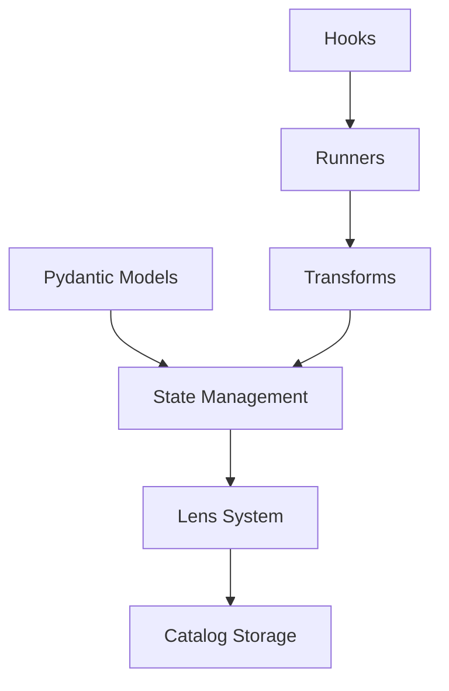

# Core Concepts

Understanding PyPond's core concepts will help you build effective data pipelines. This guide covers the fundamental building blocks and how they work together.

## Architecture Overview

PyPond is built around five key components:



## Pydantic Models as Schema

Your data schema is defined using pydantic models, which provide:
- **Type Safety**: Automatic validation of data types
- **Structure Definition**: Hierarchical organization of your data
- **Field Metadata**: Configuration for file handling and storage

```python
from pydantic import BaseModel
from pond import Field, File
import numpy as np

class ProcessingParams(BaseModel):
    threshold: float
    window_size: int
    
class Dataset(BaseModel):
    raw_data: File[np.ndarray] = Field(ext="npy")
    processed_data: File[np.ndarray] = Field(ext="npy")
    metadata: dict[str, str]

class Pipeline(BaseModel):
    params: ProcessingParams
    datasets: list[Dataset]
    summary: dict[str, float]
```

## State Management

The `State` object provides the main interface for data access:

```python
state = State(Pipeline, catalog)

# Dictionary-style access
state["params.threshold"] = 0.5
threshold = state["params.threshold"]

# Array access with indexing  
state["datasets[0].metadata"] = {"source": "sensor_1"}
first_meta = state["datasets[0].metadata"]

# Advanced lens access
lens = state.lens("datasets[:].processed_data")
```

### Path Syntax

PyPond uses dot-separated paths to navigate your data hierarchy:

- `"params.threshold"` - Scalar field access
- `"datasets[0].raw_data"` - Array element access
- `"datasets[:].metadata"` - Array wildcard access
- `"table:datasets[:].raw_data"` - Variant access (returns PyArrow table)
- `"file:datasets[:].processed_data"` - File variant (returns file contents)

## Transform System

Transforms are the computational units that process data between locations in your catalog.

### Transform Types

PyPond automatically selects the appropriate transform type based on input/output patterns:

#### Transform (Scalar → Scalar)
```python
@node(Pipeline, "params.threshold", "summary.avg_threshold")
def compute_average_threshold(threshold: float) -> float:
    return threshold * 0.95
```

#### TransformList (Array → Array)  
```python
@node(Pipeline, "datasets[:].raw_data", "datasets[:].processed_data")
def process_dataset(raw: np.ndarray) -> np.ndarray:
    return np.convolve(raw, np.ones(5)/5, mode='same')
```

#### TransformListFold (Array → Scalar)
```python
@node(Pipeline, "datasets[:].metadata", "summary.total_sources")
def count_sources(metadata_list: list[dict]) -> int:
    return len(set(meta.get("source", "unknown") for meta in metadata_list))
```

### Path Resolution

The transform system analyzes your input/output paths to determine data dependencies:

```python
# This transform depends on ALL datasets being processed
@node(Pipeline, "datasets[:].processed_data", "summary.global_stats") 
def compute_global_stats(processed_data: list[np.ndarray]) -> dict:
    all_data = np.concatenate(processed_data)
    return {
        "mean": float(np.mean(all_data)),
        "std": float(np.std(all_data)),
        "count": len(all_data)
    }
```

## Lens System

The lens system provides flexible data access patterns:

### Variants

Lenses support different access variants:

- **`default`**: Returns pydantic objects (automatic)
- **`table`**: Returns PyArrow tables for efficient computation
- **`file`**: Returns unwrapped file contents

```python
# Get structured data
params = state.lens("params").get()  # Returns ProcessingParams object

# Get tabular data for computation  
table = state.lens("table:datasets[:].raw_data").get()  # Returns pa.Table

# Get file contents directly
arrays = state.lens("file:datasets[:].raw_data").get()  # Returns list[np.ndarray]
```

### Advanced Operations

```python
lens = state.lens("datasets[:].processed_data")

# Check existence
if lens.exists():
    # Get length
    count = lens.len()
    
    # Load data
    data = lens.get()
    
    # Set data (with append option)
    lens.set(new_data, append=True)
```

## Catalog Storage

Catalogs provide persistent storage with different backend options:

### Iceberg Catalog
- **Best for**: Large datasets, schema evolution, analytics workloads
- **Features**: ACID transactions, time travel, partition optimization

```python
from pond.catalogs.iceberg_catalog import IcebergCatalog
catalog = IcebergCatalog(name="analytics", db_path="./warehouse")
```

### Lance Catalog  
- **Best for**: Vector data, fast queries, machine learning workloads
- **Features**: Columnar storage, vector search, version control

```python
from pond.catalogs.lance_catalog import LanceCatalog
catalog = LanceCatalog(db_path="./lance_db")
```

### Delta Catalog
- **Best for**: Streaming data, incremental updates, data lakes
- **Features**: ACID transactions, streaming support, schema enforcement

```python
from pond.catalogs.delta_catalog import DeltaCatalog
catalog = DeltaCatalog(db_path="./delta_lake")
```

## Execution Models

### Sequential Execution
- **Use for**: Development, debugging, simple pipelines
- **Characteristics**: Deterministic order, easy debugging, single-threaded

```python
from pond.runners.sequential_runner import SequentialRunner
runner = SequentialRunner()
```

### Parallel Execution
- **Use for**: Production, large datasets, independent transforms  
- **Characteristics**: Automatic dependency resolution, multi-process, optimized throughput

```python
from pond.runners.parallel_runner import ParallelRunner
runner = ParallelRunner()
```

## Hooks and Extensibility

Hooks provide extensibility points throughout pipeline execution:

```python
from pond.hooks.ui_hook import UIHook

# Add monitoring and visualization
hooks = [UIHook(port=8080, username="analyst", project="pipeline")]
runner.run(state, pipeline, hooks)
```

Common hook use cases:
- **Monitoring**: Track execution progress and performance
- **Visualization**: Display intermediate results and data flow
- **Logging**: Record detailed execution information
- **Debugging**: Inspect data at each pipeline stage
- **Profiling**: Measure resource usage and bottlenecks

## Data Flow Example

Here's how data flows through a PyPond pipeline:

```python
# 1. Define schema
class DataPipeline(BaseModel):
    raw_files: list[File[np.ndarray]] = Field(path="input/*.npy")
    processed: list[np.ndarray]  
    summary: dict[str, float]

# 2. Create transforms
@node(DataPipeline, "file:raw_files[:]", "processed[:]")
def normalize_data(data: np.ndarray) -> np.ndarray:
    return (data - data.mean()) / data.std()

@node(DataPipeline, "processed[:]", "summary")  
def compute_summary(data_list: list[np.ndarray]) -> dict:
    all_data = np.concatenate(data_list)
    return {"mean": float(all_data.mean()), "size": len(all_data)}

# 3. Execute pipeline
state = State(DataPipeline, catalog)
pipeline = pipe([normalize_data, compute_summary])
runner.run(state, pipeline, hooks=[])
```

The execution flow:
1. **Index files**: Discover input files and create catalog entries
2. **Load raw data**: Read files using the lens system  
3. **Transform data**: Apply normalization to each array
4. **Store intermediate results**: Save processed arrays to catalog
5. **Compute summary**: Aggregate results across all arrays
6. **Store final results**: Save summary to catalog

This approach ensures type safety, efficient storage, and clear data lineage throughout your pipeline.