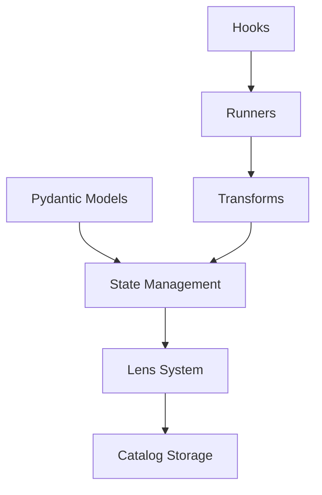

# Core Concepts

Understanding PyPond's core concepts will help you build effective data pipelines. This guide covers the fundamental building blocks and how they work together.

## Architecture Overview

PyPond is built around five key components:



## Pydantic Models as Schema

Your data schema is defined using pydantic models, which provide:
- **Type Safety**: Automatic validation of data types
- **Structure Definition**: Hierarchical organization of your data
- **Field Metadata**: Configuration for file handling and storage

```python
from pydantic import BaseModel
from pond import Field, File
from pond.io.readers import read_npz
from pond.io.writers import write_npz
import numpy as np

class ProcessingParams(BaseModel):
    threshold: float
    window_size: int
    
class DatasetMetadata(BaseModel):
    source: str
    version: str
    
class Summary(BaseModel):
    avg_threshold: float
    total_sources: int
    
class Dataset(BaseModel):
    raw_data: File[np.ndarray] = Field(reader=read_npz, writer=write_npz, ext="npz")
    processed_data: File[np.ndarray] = Field(reader=read_npz, writer=write_npz, ext="npz")
    metadata: DatasetMetadata

class Pipeline(BaseModel):
    params: ProcessingParams
    datasets: list[Dataset]
    summary: Summary
```

## State Management

The `State` object provides the main interface for data access:

```python
import tempfile
from pydantic import BaseModel
from pond import Field, File, State
from pond.catalogs.iceberg_catalog import IcebergCatalog
from pond.io.readers import read_npz
from pond.io.writers import write_npz
import numpy as np

# Define the models from the previous example
class ProcessingParams(BaseModel):
    threshold: float
    window_size: int
    
class DatasetMetadata(BaseModel):
    source: str
    version: str
    
class Summary(BaseModel):
    avg_threshold: float
    total_sources: int
    
class Dataset(BaseModel):
    raw_data: File[np.ndarray] = Field(reader=read_npz, writer=write_npz, ext="npz")
    processed_data: File[np.ndarray] = Field(reader=read_npz, writer=write_npz, ext="npz")
    metadata: DatasetMetadata

class Pipeline(BaseModel):
    params: ProcessingParams
    datasets: list[Dataset]
    summary: Summary

# Set up catalog and storage
temp_dir = tempfile.mkdtemp(prefix="pypond_example_")
storage_dir = tempfile.mkdtemp(prefix="pypond_storage_")

catalog = IcebergCatalog(
    "default",
    type="sql",
    uri=f"sqlite:///{temp_dir}/catalog.db",
    warehouse=f"file://{temp_dir}",
)
catalog.catalog.create_namespace_if_not_exists("catalog")

# Configure volume protocol for file storage
volume_protocol_args = {"dir": {"path": storage_dir}}
state = State(Pipeline, catalog, volume_protocol_args=volume_protocol_args)

# Create sample data
np.random.seed(42)
sample_data = np.random.randn(100)

# Dictionary-style access
state["params.threshold"] = 0.5
threshold = state["params.threshold"]

# Array access with indexing - create dataset with file data
state["file:datasets[0].raw_data"] = sample_data
state["datasets[0].metadata"] = DatasetMetadata(source="sensor_1", version="1.0")
first_meta = state["datasets[0].metadata"]

# Advanced lens access
lens = state.lens("datasets[:].processed_data")
```

### Path Syntax

PyPond uses dot-separated paths to navigate your data hierarchy:

- `"params.threshold"` - Scalar field access
- `"datasets[0].raw_data"` - Array element access
- `"datasets[:].metadata"` - Array wildcard access
- `"table:datasets[:].raw_data"` - Variant access (returns PyArrow table)
- `"file:datasets[:].processed_data"` - File variant (returns file contents)

## Transform System

Transforms are the computational units that process data between locations in your catalog.

### Transform Types

PyPond automatically selects the appropriate transform type based on input/output patterns:

#### Transform (Scalar → Scalar)
```python
from pond import node
from pydantic import BaseModel
import numpy as np
from pond import Field, File
from pond.io.readers import read_npz
from pond.io.writers import write_npz

# Define the Pipeline model for this example
class ProcessingParams(BaseModel):
    threshold: float
    window_size: int
    
class DatasetMetadata(BaseModel):
    source: str
    version: str
    
class Summary(BaseModel):
    avg_threshold: float
    total_sources: int
    
class Dataset(BaseModel):
    raw_data: File[np.ndarray] = Field(reader=read_npz, writer=write_npz, ext="npz")
    processed_data: File[np.ndarray] = Field(reader=read_npz, writer=write_npz, ext="npz")
    metadata: DatasetMetadata

class Pipeline(BaseModel):
    params: ProcessingParams
    datasets: list[Dataset]
    summary: Summary

@node(Pipeline, "params.threshold", "summary.avg_threshold")
def compute_average_threshold(threshold: float) -> float:
    return threshold * 0.95
```

#### TransformList (Array → Array)  
```python
from pond import node
from pydantic import BaseModel
import numpy as np
from pond import Field, File
from pond.io.readers import read_npz
from pond.io.writers import write_npz

# Define the Pipeline model for this example
class ProcessingParams(BaseModel):
    threshold: float
    window_size: int
    
class DatasetMetadata(BaseModel):
    source: str
    version: str
    
class Summary(BaseModel):
    avg_threshold: float
    total_sources: int
    
class Dataset(BaseModel):
    raw_data: File[np.ndarray] = Field(reader=read_npz, writer=write_npz, ext="npz")
    processed_data: File[np.ndarray] = Field(reader=read_npz, writer=write_npz, ext="npz")
    metadata: DatasetMetadata

class Pipeline(BaseModel):
    params: ProcessingParams
    datasets: list[Dataset]
    summary: Summary

@node(Pipeline, "file:datasets[:].raw_data", "file:datasets[:].processed_data")
def process_dataset(raw: np.ndarray) -> np.ndarray:
    return np.convolve(raw, np.ones(5)/5, mode='same')
```

#### TransformListFold (Array → Scalar)
```python
from pond import node
from pydantic import BaseModel
import numpy as np
from pond import Field, File
from pond.io.readers import read_npz
from pond.io.writers import write_npz

# Define the Pipeline model for this example
class ProcessingParams(BaseModel):
    threshold: float
    window_size: int
    
class DatasetMetadata(BaseModel):
    source: str
    version: str
    
class Summary(BaseModel):
    avg_threshold: float
    total_sources: int
    
class Dataset(BaseModel):
    raw_data: File[np.ndarray] = Field(reader=read_npz, writer=write_npz, ext="npz")
    processed_data: File[np.ndarray] = Field(reader=read_npz, writer=write_npz, ext="npz")
    metadata: DatasetMetadata

class Pipeline(BaseModel):
    params: ProcessingParams
    datasets: list[Dataset]
    summary: Summary

@node(Pipeline, "datasets[:].metadata", "summary.total_sources")
def count_sources(metadata_list: list[DatasetMetadata]) -> int:
    return len(set(meta.source for meta in metadata_list))
```

### Path Resolution

The transform system analyzes your input/output paths to determine data dependencies:

```python
# Example of complex transform requiring ALL datasets
print("Transform with dependencies on all processed data:")
print("Input: all processed arrays")
print("Output: global statistics (mean, std, count)")
print("This ensures all datasets are processed before computing global stats")
```

## Lens System

The lens system provides flexible data access patterns:

### Variants

Lenses support different access variants:

- **`default`**: Returns pydantic objects (automatic)
- **`table`**: Returns PyArrow tables for efficient computation
- **`file`**: Returns unwrapped file contents

```python
# Example usage (requires a state object from previous examples)
print("Lens variants provide different data access patterns")
print("- Default: pydantic objects")
print("- Table: PyArrow tables for computation")
print("- File: Raw file contents")
```

### Advanced Operations

```python
# Example lens operations (requires a state object from previous examples)
print("Lens operations:")
print("- exists(): Check if data exists")
print("- len(): Get data length")
print("- get(): Load data")
print("- set(): Store data")
```

## Catalog Storage

Catalogs provide persistent storage with different backend options:

### Iceberg Catalog
- **Best for**: Large datasets, schema evolution, analytics workloads
- **Features**: ACID transactions, time travel, partition optimization

```python
import tempfile
from pond.catalogs.iceberg_catalog import IcebergCatalog

temp_dir = tempfile.mkdtemp(prefix="analytics_")
catalog = IcebergCatalog(
    "analytics",
    type="sql",
    uri=f"sqlite:///{temp_dir}/catalog.db",
    warehouse=f"file://{temp_dir}"
)
```

### Lance Catalog  
- **Best for**: Vector data, fast queries, machine learning workloads
- **Features**: Columnar storage, vector search, version control

```python
from pond.catalogs.lance_catalog import LanceCatalog
catalog = LanceCatalog(db_path="./lance_db")
```

### Delta Catalog
- **Best for**: Streaming data, incremental updates, data lakes
- **Features**: ACID transactions, streaming support, schema enforcement

```python
from pond.catalogs.delta_catalog import DeltaCatalog
catalog = DeltaCatalog(db_path="./delta_lake")
```

## Execution Models

### Sequential Execution
- **Use for**: Development, debugging, simple pipelines
- **Characteristics**: Deterministic order, easy debugging, single-threaded

```python
from pond.runners.sequential_runner import SequentialRunner
runner = SequentialRunner()
```

### Parallel Execution
- **Use for**: Production, large datasets, independent transforms  
- **Characteristics**: Automatic dependency resolution, multi-process, optimized throughput

```python
from pond.runners.parallel_runner import ParallelRunner
runner = ParallelRunner()
```

## Hooks and Extensibility

Hooks provide extensibility points throughout pipeline execution:

```python
# UIHook provides Hamilton UI integration for monitoring
print("UIHook enables pipeline visualization and monitoring")
print("Requires Hamilton UI service to be running")
```

Common hook use cases:
- **Monitoring**: Track execution progress and performance
- **Visualization**: Display intermediate results and data flow
- **Logging**: Record detailed execution information
- **Debugging**: Inspect data at each pipeline stage
- **Profiling**: Measure resource usage and bottlenecks

## Data Flow Example

Here's how data flows through a PyPond pipeline:

```python
from pydantic import BaseModel
from pond import Field, File, State, node, pipe
import numpy as np

class PipelineSummary(BaseModel):
    mean: float
    size: int

# 1. Define schema
class DataPipeline(BaseModel):
    raw_files: list[File[np.ndarray]] = Field(path="input/*.npy")
    processed: list[File[np.ndarray]] = Field(ext="npy")  # Use File for storage
    summary: PipelineSummary

# 2. Create transforms
@node(DataPipeline, "file:raw_files[:]", "file:processed[:]")
def normalize_data(data: np.ndarray) -> np.ndarray:
    return (data - data.mean()) / data.std()

@node(DataPipeline, "file:processed[:]", "summary")  
def compute_summary(data_list: list[np.ndarray]) -> PipelineSummary:
    all_data = np.concatenate(data_list)
    return PipelineSummary(mean=float(all_data.mean()), size=len(all_data))

# 3. Execute pipeline (example structure)
print("Pipeline execution involves:")
print("1. Index files and create catalog entries")
print("2. Load raw data using lens system") 
print("3. Transform data through normalization")
print("4. Store intermediate results")
print("5. Compute summary statistics")
print("6. Store final results")
```

The execution flow:
1. **Index files**: Discover input files and create catalog entries
2. **Load raw data**: Read files using the lens system  
3. **Transform data**: Apply normalization to each array
4. **Store intermediate results**: Save processed arrays to catalog
5. **Compute summary**: Aggregate results across all arrays
6. **Store final results**: Save summary to catalog

This approach ensures type safety, efficient storage, and clear data lineage throughout your pipeline.